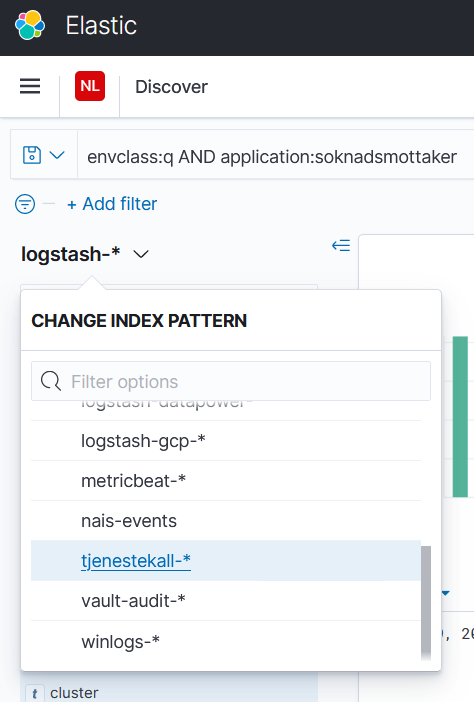

# Soknadsmottaker
When a user applies for a benefit (_sender inn en søknad_), one or more documents are sent in to NAV. This component acts as a REST-endpoint to which the systems that the user uses can send metadata about the benefit. The documents themselves are sent to a different system, [Soknadsfillager](https://www.github.com/navikt/soknadsfillager).

When Soknadsmottaker receives data, it will be converted, serialized as an Avro message and put on a Kafka topic.

For a description of the whole archiving system, see [the documentation](https://github.com/navikt/archiving-infrastructure/wiki).

## Rest-API
The Rest-API can be accessed here:

* [localhost](http://localhost:8090/swagger-ui/index.html)
* [preprod](https://soknadsmottaker-gcp.dev.intern.nav.no/swagger-ui/index.html)
* [loadtests (preprod)](https://soknadsmottaker-gcp-loadtests.dev.intern.nav.no/swagger-ui/index.html)
* [prod](https://soknadsmottaker-gcp.intern.nav.no/swagger-ui/index.html)

# Dependencies
This component requires the following to work:
* [soknadarkiv-schema](https://github.com/navikt/soknadarkiv-schema) (Avro schema definitions)
* Kafka broker (for providing Kafka topics to send to)
* Shared secrets on Vault.


## Secure logs
The application will log the requests it receives, but mask the personId / fødselsnummer / fnr. For debugging and resending purposes, the fnr is needed. It can be found in the secure logs of the application.

### Kibana
The secure logs can be accessed from [Kibana](https://logs.adeo.no/app/discover#/?_g=(filters:!(),refreshInterval:(pause:!t,value:0),time:(from:now-1h,to:now))&_a=(columns:!(message,envclass,level,application,host),filters:!(),index:'tjenestekall-*',interval:auto,query:(language:lucene,query:'envclass:q%20AND%20application:soknadsmottaker'),sort:!())). Change index in Kibana from `logstash-*` to `tjenestekall-*` in the left menu, as in the screenshot below. If you lack access, it is most likely because you are not in the AD-group. See [the nais documentation](https://doc.nais.io/observability/logs/#3-put-people-into-the-ad-group) for details.



### Kubectl
The secure logs can be accessed from the terminal using kubectl as shown below. Remember to look in all pods for the log line that you search for.
```
$ kubectl -n team-soknad get pods | grep soknadsmottaker
soknadsmottaker-86745fb779-lndkn    3/3    Running    0    2d18h
soknadsmottaker-86745fb779-r7ffk    3/3    Running    0    2d18h

$ kubectl -n team-soknad exec --stdin --tty soknadsmottaker-86745fb779-lndkn -- /bin/bash
Defaulting container name to soknadsmottaker.
Use 'kubectl describe pod/soknadsmottaker-86745fb779-lndkn -n team-soknad' to see all of the containers in this pod.

apprunner@soknadsmottaker-86745fb779-lndkn:/app$ ls -la /secure-logs/
total 14344
drwxrwxrwx. 2 root      root          4096 feb.  22 15:35 .
drwxr-xr-x. 1 root      root          4096 feb.  22 15:35 ..
-rw-r--r--. 1 apprunner apprunner 14666703 feb.  25 10:17 secure.log
-rw-r--r--. 1      1065      1065        0 feb.  22 15:35 secure-logs-mlog.pos
-rw-r--r--. 1      1065      1065       58 feb.  25 10:17 secure-logs.pos

apprunner@soknadsmottaker-86745fb779-lndkn:/app$ cat /secure-logs/secure.log
<LOG CONTENT>
```

## Resending requests
If a Soknad for some reason fails to be sent through the whole archiving chain, a last resort is to manually resend it, as explained below. Save your data into a json-file called "soknader.json" (an example can be seen [here](mottaker/src/main/resources/soknader.json)), and run the script below (requires curl and [jq](https://github.com/stedolan/jq)). To send failed files to Soknadsfillager, see [its documentation](https://github.com/navikt/soknadsfillager#manually-sending-files-to-soknadsfillager).

Run the script first against localhost:8090 (i.e. start Soknadsmottaker on your own machine) to see that it works as expected. Then do a test run against preprod (i.e. replace `soknadsmottakerurl` with https://soknadsmottaker-gcp.dev.intern.nav.no). When you have verified that the behaviour and data is as expected, you can run against production with care.

One must never send in a Soknad with the same innsendingId as a previous one. The script will replace whatever innsendingId is set to, with a newly generated UUID.

Update `credentials` with the username and password, which you can find in [GCP Secret Manager](https://console.cloud.google.com/security/secret-manager/secret/shared-innsending-secret/versions?project=team-soknad-dev-ee5e) (remember to select the correct project - dev or prod). Note that the script will save the password to your shell history (e.g. in ~/.bash_history), which is a bad side effect. Two options are available:
* After running the script, you can manually remove the password from your shell history file.
* You can set `credentials=innsending` rather than `credentials=innsending:password`. This will make curl prompt you for the password for each Soknad in soknader.json. If you have only a few Soknader to send in it should be no problem, but if you have many it might be cumbersome, and you should in that case opt for manually cleaning your shell history file instead.
```
soknadsmottakerurl=http://localhost:8090/soknad ;\
credentials=innsending:password ;\
jq -c '.[] | objects' soknader.json  | while read obj ; do
    jq -c --arg id $(uuidgen) '.innsendingId = $id' <<< "$obj" \
    | curl -X POST -H 'Content-Type: application/json' -d @- $soknadsmottakerurl -u $credentials
done
```

## Inquiries
Questions regarding the code or the project can be asked to the team by [raising an issue on the repo](https://github.com/navikt/soknadsmottaker/issues).

### For NAV employees
NAV employees can reach the team by Slack in the channel #teamsoknad
